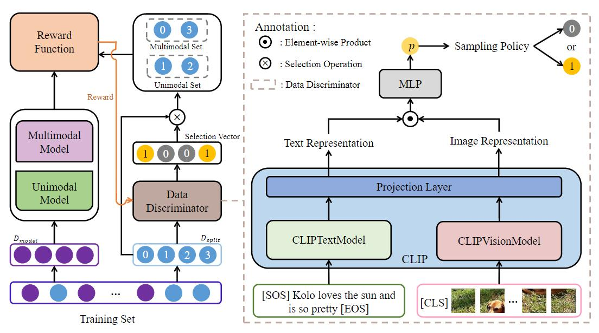

# RDS (**R**einforced Data **S**plitting)

The pytorch implementation of "**Different Data, Different Modalities! Reinforced Data Splitting for Effective Multimodal Information Extraction from Social Media Posts**" (COLING 2022).



# Environment

We recommend the following actions to create the environment:

```bash
conda deactivate # Leaving the current environment
conda create -n RDS python==3.6.13 # Create a new environment with python==3.6.13
conda activate RDS # Activating the environment
pip install -r requirements.txt # Install the required libraries
```

# Data Download

We use Twitter2015 and Twitter2017 on the MNER task and MNRE on the MRE task. At the end of this section, we provide links to the data and introduce the waht is in the provided links.

## Twitter2015 and Twitter2017 (MNER)

We used data about MNER from [JefferyYu](https://github.com/jefferyYu/UMT),  from which you can download the original data.  Since we need to split the training set, we provide the split training set, which you can download [here](https://drive.google.com/drive/folders/1Tx1LtfS4TgxYuy3Af2ut2MZ_boKnqfUG?usp=sharing). Of course, you can also use your own way to split the training set. 

**Note**: In `data/twitter2015` and `data/twitter2017` at the link we provided , train.txt is the original complete training set, **train_pre.txt** is 80% of the data randomly selected from train.txt for training the multimodal and unimodal models, and **train_rl.txt** is 20% of the data randomly selected from train.txt for training the data discriminator.

## MNRE (MRE)

We used data about MRE from [thecharm](https://github.com/thecharm/Mega),  from which you can download the original data. We also provide the split training set about MRE, which you can download [here](https://drive.google.com/drive/folders/12y-6RG2uwpkab96ZFI-Thk5rUIWTQWYn?usp=sharing).

**Note**: In `benchmark/ours/txt` at the link we provided , ours_train.txt is the original complete training set, **ours_train_pre.txt** is 80% of the data randomly selected from train.txt for training the multimodal and unimodal models, and **ours_train_rl.txt** is 20% of the data randomly selected from train.txt for training the data discriminator.

We also provide MNER and MRE data in the next contet (contain our split training set data, image data, and raw text data).

**Note**:  In the dowonload links we provide:

- [data](https://drive.google.com/drive/folders/1Tx1LtfS4TgxYuy3Af2ut2MZ_boKnqfUG?usp=sharing) stores the text data of Twitter2015 and Twitter2017, and also contains our split training set.
- [benckmark](https://drive.google.com/drive/folders/12y-6RG2uwpkab96ZFI-Thk5rUIWTQWYn?usp=sharing) stores the text data of the MNRE and the data needed to run the MEGA model.
- [IJCAI2019_data](https://drive.google.com/drive/folders/1ijPGikFLjhmSHaAA0vfNd_csP53SLtpR?usp=sharing) stores the image data of Twitter2015 and Twitter2017.
- [mnre_img](https://drive.google.com/drive/folders/1DfnN10dSqaHaS7XSPQREkKiNRoS_q0gJ?usp=sharing)   stores the image data of MNRE.

# Required pre-trained models

## Bert-base-cased

In the MNER task, we use bert-base-cased as a text encoder, which you can download [here](https://huggingface.co/bert-base-cased). 

## Bert-base-uncased

In the MRE task ,we use bert-base-uncased as a text encoder, which you can download [here](https://huggingface.co/bert-base-uncased).

## CLIP

Our data discriminator includes a pre-trained model CLIP, which you can download [here](https://huggingface.co/openai/clip-vit-base-patch32).

**Note**: After downloading the pre-trained model, it should be placed in the `pretrained_models` folder to avoid modifying the code.

# Multimodal and Unimodal Model Training 

We use part of the data (80% of the training set data in the paper, named train_pre.txt or ours_train_pre.txt in the training set we provide) to train multimodal and unimodal models.

We used two multimodal models, UMT and MAF, and one unimodal model, BERT-CRF, in the MNER task.

We used a multimodal model and a unimodal model for MEGA and MTB, respectively, on the MRE task.

At the end of this section, we provide links to the model paramters and introduce what is in the provided links.

## UMT (MNER Model)

The model comes from [JefferyYu](https://github.com/jefferyYu/UMT), and you can train the model with the code it provides. We have introduced the model in the code `my_bert/mner_modeling.py line-1268 `  and provided its parameters after training on the Twitter 2015 dataset, which you can download [here](https://drive.google.com/drive/folders/1-FbjYi-X6BvlC_Gu4lwmLZkvzUqxGBU1?usp=sharing).

## MAF (MNER Model)

The model comes from [xubodhu](https://github.com/xubodhu/MAF), and you can train the model with the code it provides. We have introduced the model in the code `my_bert/mner_modeling.py line-1365 ` .

## BERT-CRF (Text-based NER Model)

The model consists of BERT as the text encoder and CRF as the decoder.  We have introduced the model in the code `my_bert/mner_modeling.py line-1246 `  and provided its parameters after training on the Twitter  2015 dataset, which you can download [here](https://drive.google.com/drive/folders/1-FbjYi-X6BvlC_Gu4lwmLZkvzUqxGBU1?usp=sharing).

## MEGA (MRE Model)

The model comes from [thecharm](https://github.com/thecharm/Mega), and you can train the model with the code it provides. We have introduced the model in the code `opennre/encoder/bert_encoder line-114 `  and provided its parameters after training on the MRE dataset, which you can download [here](https://drive.google.com/drive/folders/1-FbjYi-X6BvlC_Gu4lwmLZkvzUqxGBU1?usp=sharing). .

## MTB (Text-based RE Model)

The model comes from [thecharm](https://github.com/thecharm/Mega)  and its reference [OpenNRE](https://github.com/thunlp/OpenNRE) for implementation. You can train the model with the code it provides.  We have introduced the model in the code `opennre/encoder/bert_encoder line-269`  and provided its parameters after training on the MRE dataset, which you can download [here](https://drive.google.com/drive/folders/1-FbjYi-X6BvlC_Gu4lwmLZkvzUqxGBU1?usp=sharing).

**Note**:  In the download [links](https://drive.google.com/drive/folders/1-FbjYi-X6BvlC_Gu4lwmLZkvzUqxGBU1?usp=sharing) we provide, 

- `pytorch_encoder.bin` is the parameters of the ResNet model, and `pytorch_encoder_2015.bin` is the parameters of the ResNet model after training in the Twitter2015 task. 

- `umt_2015.bin`  and `bert_crf_2015.bin` are the multimodal and  unimodal  models trained in train_pre.txt (Twitter2015), respectively.

- `umt_2015_all.bin`  and `bert_crf_2015_all.bin` are the multimodal and  unimodal  models trained in train.txt (Twitter2015), respectively.

- `MEGA.pth.tar`  and `MTB.pth.tar` are the multimodal and  unimodal  models trained in ours_train_pre.txt (MNRE), respectively.

- `MEGA_all.pth.tar`  and `MTB_all.pth.tar` are the multimodal and  unimodal  models trained in ours_train.txt (MNRE), respectively.

- `prob_2015.txt` and `prob_mre.txt` are the prediction results of our trained data discriminator on Twitter2015 and on the MNRE dataset, respectively.

# Structure of Files

After you have prepared the required data as well as the model, your file structure should look like this:

```
RDS
 |-- data	# MNER text data
 |    |-- twitter2015
 |    |    |    |-- train.txt	# Training set
 |    |    |    |-- train_pre.txt	# 80% of the training set
 |    |    |    |-- train_rl.txt	# 20% of the training set
 |    |    |    |-- valid.txt	# Validation set
 |    |    |    |-- test.txt	# Test set
 |    |-- twitter2017
 |    |    |    |-- train.txt	# Training set
 |    |    |    |-- train_pre.txt	# 80% of the training set
 |    |    |    |-- train_rl.txt	# 20% of the training set
 |    |    |    |-- valid.txt	# Validation set
 |    |    |    |-- test.txt	# Test set

 |-- IJCAI2019_data	# MNER images
 |    |-- twitter2015_images	# Raw images in Twitter 2015
 |    |-- twitter2017_images	# Raw images in Twitter 2017

 |-- benchmark	# MRE text data
 |    |-- ours
 |    |    |    |-- txt	# MNRE text data
 |    |    |    |-- rel_1
 |    |    |    |-- imgSG

 |-- mnre_img	# MRE images
 |    |-- img_org
 |    |    |    |-- train	# Raw images in MNRE training set
 |    |    |    |-- val	# Raw images in MNRE Validation set
 |    |    |    |-- test	# # Raw images in MNRE Test set

 |-- resnet
 |    |-- resnet_utils.py
 |    |-- resnet.py

 |-- modules
 |    |-- Reward.py	# Training data discriminator (MNER)
 |    |-- Reward_mre.py	# Training data discriminator (MRE)
 |    |-- Eval.py	
 |    |-- Partitioner.py	
 |    |-- preprocess.py	

 |-- opennre	# MRE Model
 |    |-- model
 |    |-- encoder
 |    |-- ...

 |-- my_bert	# MNER Model
 |    |-- mner_modeling.py
 |    |-- ...
 
 |-- pretrained_models
 |    |-- bert-base-uncased
 |    |-- bert-base-cased
 |    |-- CLIP_model

 |-- run_mner.py # main (MNER)

 |-- run_mre.py # main (MRE)

 |-- ner_evaluate.py
```

# Training Data Discriminator

We use part of the data (20% of the training set data in the paper, named train_rl.txt in the training set we provide) to train data discriminator.

Before training the data discriminator, **it is necessary to ensure that the corresponding multimodal and unimodal models have been trained**. In the last part of **Model Training**, we present the trained models provided in the link.

## MNER Task

After you have prepared the required data and models (if you are using Twitter 2015, you can train yourself or use the `bert_crf_2015.bin` and `umt_2015.bin + pytorch_encoder.bin` we provide), you can run `run_mner.py` to train data discriminator on MNER.

```python
python run_mner.py --do_train
```

## MRE Task

After you have prepared the required data and models (you can train yourself or use the `MTB.pth.tar` and `MEGA.pth.tar` we provide) , you can run `run_mre.py` to train data discriminator on MRE.

```python
python run_mre.py --do_train
```

# Test Data Discriminator

## MNER Task

After you have prepared the required data, models and trained a data discriminator (if you are using Twitter 2015, you can use the models `bert_crf_2015_all.bin` , `umt_2015_all.bin + pytorch_encoder_2015.bin`  and `prob_2015.txt` we provide), you can run `run_mner.py` to test.

```python
python run_mner.py --do_test
```

## MRE Task

After you have prepared the required data, models and trained a data discriminator (you can use the models `MTB_all_pth.tar`, `MEGA_all.pth.tar` and `prob_mre.txt` we provide), you can run `run_mre.py` to test.

```python
python run_mre.py --do_test
```

